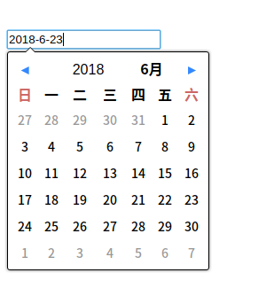

一个简单的时间选择器插件



### [下载](https://github.com/zaqmjuop/datepicker/releases/download/1.0.1/build.zip)

```html
<link rel="stylesheet" href="datepicker.min.css">
<script src="datepicker.min.js"></script>
```

```javascript
import datepicker from 'datepicker.min.js';


const input = document.querySelector('#input');
datepicker(input);
```